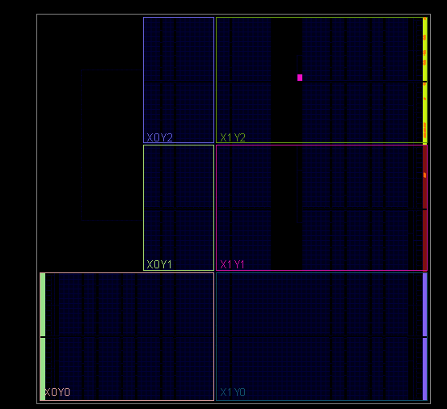
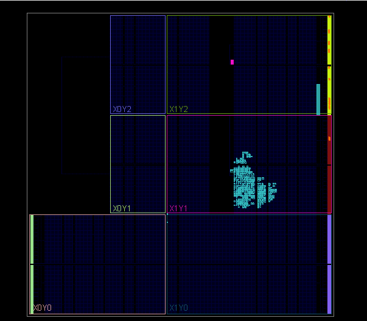
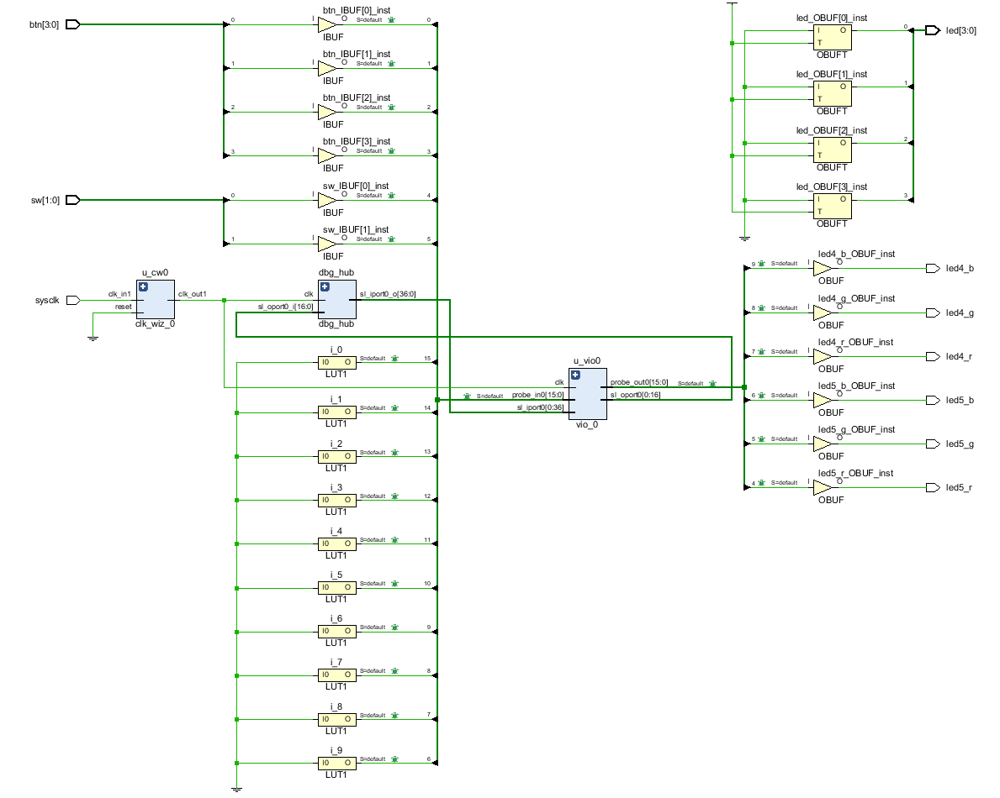
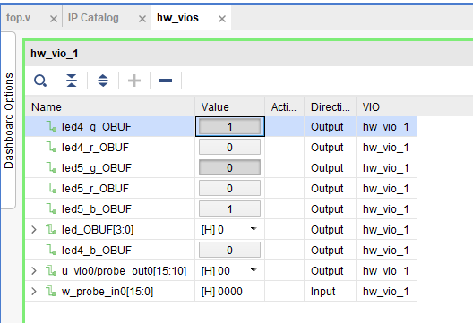
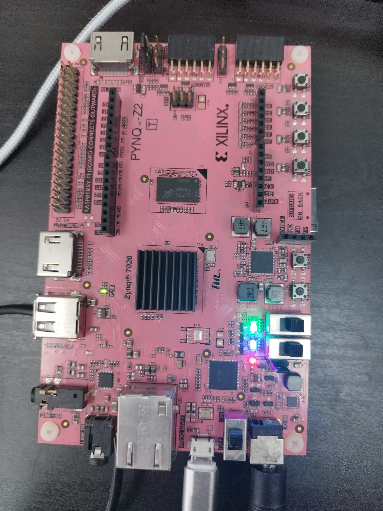
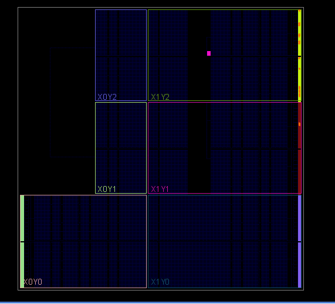
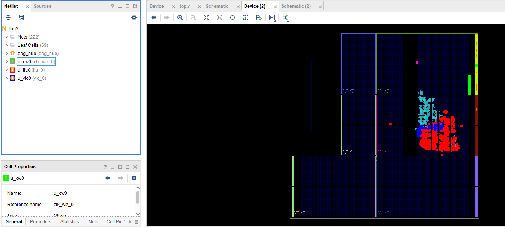
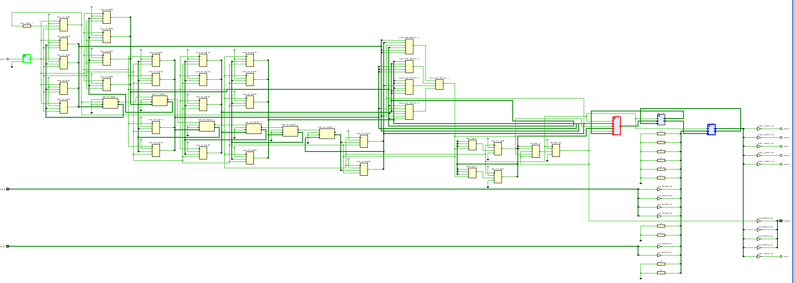
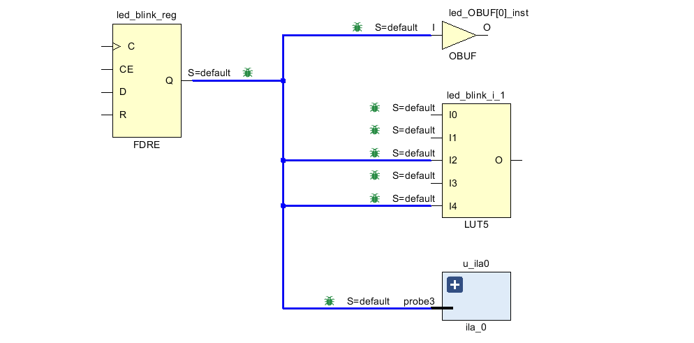
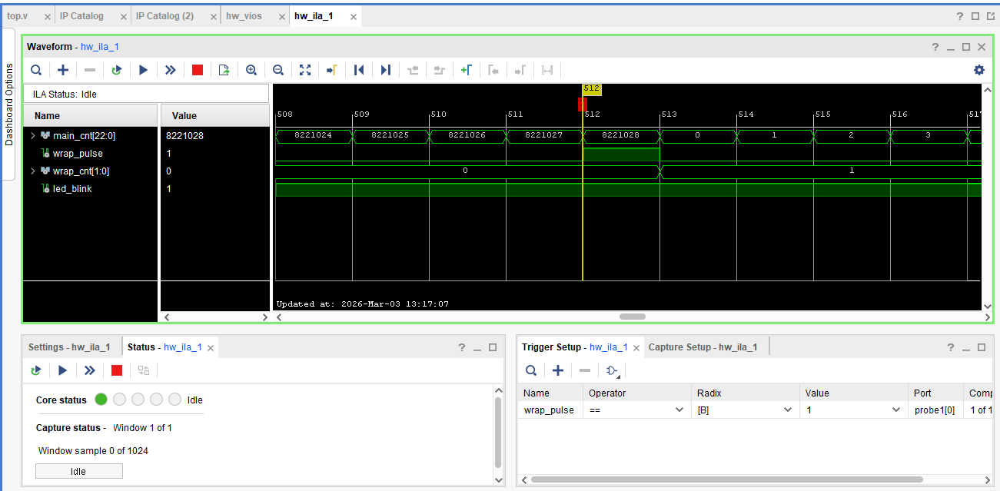

# Лабораторная работа №1. Начало работы

## Цель работы: 
Изучить базовые принципы проектирования цифровых устройств на ПЛИС
в среде Vivado. Освоить использование встроенных средств отладки,
включая Virtual Input/Output (VIO) для управления сигналами в реальном времени
и Integrated Logic Analyzer (ILA) для наблюдения внутренних сигналов схемы.
Закрепить навыки разработки синхронной логики на примере реализации
счётчика с миганием светодиодов.

## Задание 1:
На основе готового проекта выполнить загрузку конфигурации на ПЛИС
и проверить управление светодиодами платы.
Изучить работу IP-ядра VIO (Virtual Input/Output),
позволяющего изменять значения входных сигналов во время работы устройства
и наблюдать реакцию схемы без повторной генерации битового файла.

### Структура проекта
Для данного задания был предоставлен готовый проект, разберём основные составные части top модуля.

Описание портов модуля
```
module top2(
    input  wire        sysclk, //входной тактовый сигнал
    input  wire [1:0]  sw,     //переключатели на плате
    output wire        led4_b, //RGB-светодиоды
    output wire        led4_g, 
    output wire        led4_r,
    output wire        led5_b,
    output wire        led5_g,
    output wire        led5_r,
    output wire [3:0]  led,    // простые светодиоды
    input  wire [3:0]  btn     // кнопки на плате
);
```

Внутренние сигналы
```
wire [15:0] w_probe_in0;   // сигналы, которые мы получаем через VIO с платы
wire [15:0] w_probe_out0;  // сигналы, которые мы подаём с помощью VIO на плату
wire        w_clk_out1;    // внутренний тактовый сигнал
```
Генерация внутреннего тактового сигнала.
Clock wizard позволяет генерировать стабильные тактовые сигналы нужной частоты деля или умножая исходную тактовую частоту платы.
```
clk_wiz_0 u_cw0(
    .reset   (0),
    .clk_in1 (sysclk),
    .clk_out1(w_clk_out1),
    .locked  ()
);
```
Подключение VIO
```
vio_0 u_vio0(
    .clk        (w_clk_out1),
    .probe_in0  (w_probe_in0),
    .probe_out0 (w_probe_out0)
);
```
Передача входных сигналов в VIO
```
assign w_probe_in0[3:0] = btn[3:0];
assign w_probe_in0[5:4] = sw[1:0];
```
Управление светодиодами через VIO
```
assign led4_b = w_probe_out0[9];
assign led4_g = w_probe_out0[8];
assign led4_r = w_probe_out0[7];

assign led5_b = w_probe_out0[6];
assign led5_g = w_probe_out0[5];
assign led5_r = w_probe_out0[4];

assign led[3:0] = w_probe_out0[3:0];
```

### Синтез и имплементация
При синтезе перед выводом дизайна выдаёт несколько предупреждей, поэтому картика не отображается корректно, но это не влияет на работу схемы.


<p align="center">
  Рисунок 1 – Результат синтеза
</p>


<p align="center">
  Рисунок 2 – Результат имплементации
</p>


<p align="center">
  Рисунок 3 – Схематик
</p>


### Работа с VIO


<p align="center">
  Рисунок 4 – Интерфейс VIO
</p>



<p align="center">
  Рисунок 5 – Плата с горящими RGB-светодиодами
</p>


В интерфейсе VIO мы поставили у четвёртого RGB-светодиода единицу только на зелёный сигнал, поэтому такой цвет видим на плате, аналогично с синим цветом у пятого RGB-светодиода.

### Вывод по заданию 1
С помощью VIO была реализована возможность изменять значения сигналов в реальном времени без повторной генерации битового файла. Это позволило управлять состоянием светодиодов платы непосредственно из среды Vivado.

## Задание 2:
Реализовать синхронный счётчик,
интегрировать средства отладки ILA,
зафиксировать момент переполнения счётчика
и проанализировать его работу.

### Реализация счетчика
Задаем максимальное значение счетчика
```
localparam [22:0] MAX_CNT = 23'd8221028;
```
Регистр, хранящий текущее значение сетчика
```
reg [22:0] main_cnt = 23'd0;
```
Проверка на переполнение - факт, того, что нужное значение достигнуто
```
wire wrap_pulse = (main_cnt == MAX_CNT);
```
Обнуление счетчика
```
always @(posedge w_clk_out1) begin
  if (wrap_pulse)
    main_cnt <= 23'd0;
  else
    main_cnt <= main_cnt + 1'b1;
```
Счётчик реализован как синхронный, так как обновление его состояния происходит по фронту тактового сигнала.

### Подключение ILA
```
ila_0 u_ila0(
  .clk   (w_clk_out1), // тактовый сигнал
  .probe0(main_cnt),   // значение счетчика
  .probe1(wrap_pulse), // импульс при переполнении
  .probe2(wrap_cnt),   // сколько было переполнений
  .probe3(led_blink)   // сигнал мигания
);
```
Также по заданию реализуем мигание, для того, чтобы оно было не слишком частым, сделаем так, чтобы светодиод мигал только тогда, когда происходит 3 переполнения.
```
reg [1:0] wrap_cnt = 2'd0;
reg       led_blink = 1'b0;
localparam [1:0] WRAPS_PER_TOGGLE = 2'd2;

if (wrap_pulse) begin
  if (wrap_cnt == WRAPS_PER_TOGGLE) begin
    wrap_cnt  <= 2'd0;
    led_blink <= ~led_blink;
  end else begin
    wrap_cnt <= wrap_cnt + 1'b1;
  end
end
```
### Синтез и имплементация
Аналогичные предупреждения перед просмотром синтезированного дизайна


<p align="center">
  Рисунок 6 – Результат синтеза
</p>


<p align="center">
  Рисунок 7 – Результат имплементации
</p>


<p align="center">
  Рисунок 8 – Схематик
</p>
На рисунках 7 и 8 зелёным обозначен Clock wizard, красным ILA, синим VIO


<p align="center">
  Рисунок 9 – Фрагмент синтезированной логики мигания для счетчика
</p>
### Анализ с помощью ILA


<p align="center">
  Рисунок 10 – Интерфейс ILA
</p>

Открыв интерфейс ILA видим ранее указанные сигналы, их значения во времени.
Внизу справа добавляем триггер на переполнение, чтобы зафиксировать этот момент. На рисунке 10 показан момент переключения счётчика, когда он досчитал до нужного значения 8221028.
### Вывод по заданию 2:
Был реализован синхронный счётчик, работающий от внутреннего тактового сигнала. Счётчик увеличивает значение на каждом такте и при достижении заданного значения 8221028 формирует сигнал переполнения. Для визуального отображения работы счётчика была реализована логика мигания светодиода. Сигнал led_blink переключается после трёх переполнений счётчика, что обеспечивает удобную для наблюдения частоту мигания. Для анализа работы схемы был использован Integrated Logic Analyzer (ILA), позволяющий наблюдать внутренние сигналы устройства во времени. С помощью ILA был зафиксирован момент переполнения счётчика и подтверждена корректность его работы.
## Вывод:
В ходе лабораторной работы были изучены базовые этапы разработки цифровых устройств на ПЛИС в среде Vivado: синтез, имплементация и загрузка конфигурации на плату.

Были освоены встроенные средства аппаратной отладки: Virtual Input/Output (VIO), позволяющий изменять значения сигналов в процессе работы устройства, и Integrated Logic Analyzer (ILA), предназначенный для наблюдения внутренних сигналов схемы.

На практике был реализован синхронный счётчик и выполнен анализ его работы с использованием средств отладки. Полученные результаты подтвердили корректность функционирования разработанной логики.