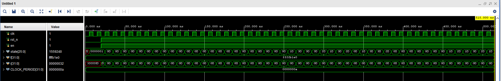
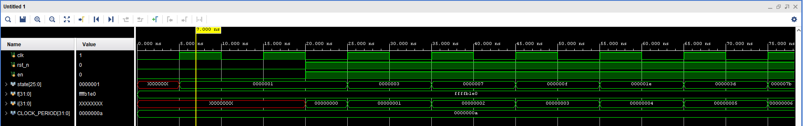
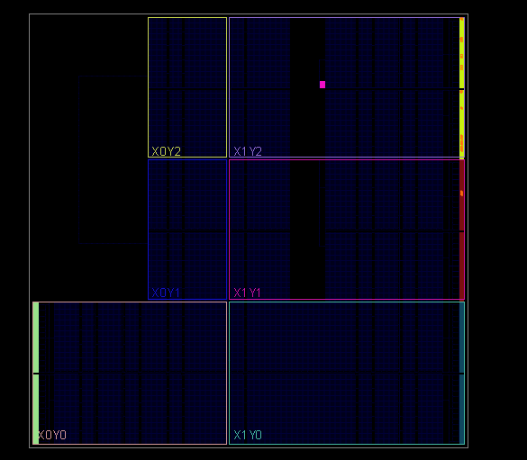
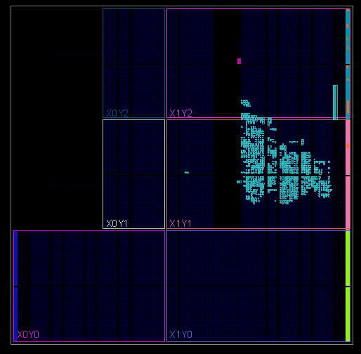
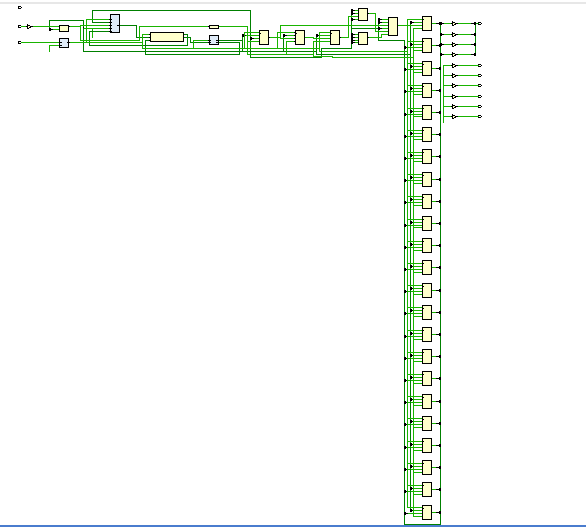
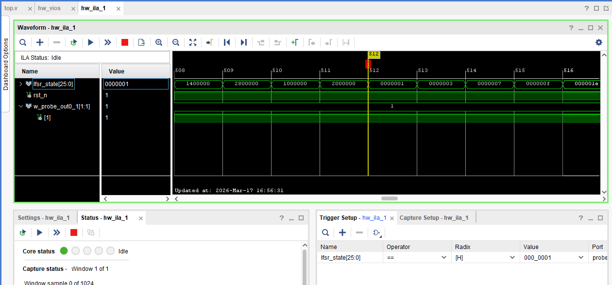

# Лабораторная работа №2. LFSR

## Цель работы: 
Изучить работу сдвигового регистра с обратной связью (LFSR), реализовать его на языке Verilog, проверить правильность работы с помощью моделирования и сравнения с golden model на Python и убедиться в корректной работе схемы на ПЛИС с использованием встроенного анализатора ILA.

### RTL-описание LFSR и тестирование
Создадим модуль lfsr26, который будет выполнять работу сдвигового регистра со схемой согласно варианту 6: [26, 24, 21, 17, 16, 14, 13, 11, 7, 6, 4, 1].
То есть биты, с указанными номерами, учитываются в подсчете результата, являющегося новым входом.


``` verilog
module lfsr26(
    input  wire        clk,
    input  wire        rst_n,
    input  wire        en,
    output reg [25:0]  state
);

wire feedback;

// Полином для варианта 6:
// [26, 24, 21, 17, 16, 14, 13, 11, 7, 6, 4, 1]
assign feedback = state[25] ^ state[23] ^ state[20] ^
                  state[16] ^ state[15] ^ state[13] ^
                  state[12] ^ state[10] ^ state[6]  ^
                  state[5]  ^ state[3]  ^ state[0];

always @(posedge clk) begin
    if (!rst_n)
        state <= 26'b1; // ненулевое начальное состояние
    else if (en)
        state <= {state[24:0], feedback};
end

endmodule
   
```
На вход модуля подаются следующие сигналы: 
- clk - тактовый сигнал
- rst_n - сигнал сброса, устанавливающий регистр в начальное состояние при rst_n = 0.
- en - сигнал, разрешающий работу

Важно, что начальное состояние регистра должно быть ненулевым, чтобы регистр функционировал.

Функционирование регистра осуществляется при rst_n = 1 и en = 1

Выходом явяется 26-ти битный регистр state, показывающий текущее состояние реализованнного сдвигового регистра.

Провод feedback хранит результат посовместительству новый вход, который вычисляется, как XOR от соотвествующих значений регистра state.

Обновление состояния регистра происходит по положительному фронту сигнала clk: 
- если rst_n = 0, то будет установлено начальное состояние
- если rst_n = 1 и en = 0, то обновление не происходит
- если rst_n = 1 и en = 1, то записывается новое состояние

Далее был создан тестбенч, для проверки корректности работы модели

``` verilog
`timescale 1ns/1ns

module lfsr26_tb;

reg clk = 0;
reg rst_n = 0;
reg en = 0;

wire [25:0] state;

integer f;
integer i;

lfsr26 dut (
    .clk   (clk),
    .rst_n (rst_n),
    .en    (en),
    .state (state)
);

parameter CLOCK_PERIOD = 10;

// генерация тактового сигнала
always #(CLOCK_PERIOD/2) clk = ~clk;

// запись VCD для просмотра временной диаграммы
initial begin
    $dumpfile("lfsr26_tb.vcd");
    $dumpvars(0, lfsr26_tb);
end

// основной сценарий теста
initial begin
    f = $fopen("lfsr26_states.txt", "w");

    // начальные условия
    rst_n = 0;
    en    = 0;

    // держим reset
    #20;
    rst_n = 1;
    en    = 1;

    // записываем 50 состояний
    for (i = 0; i < 50; i = i + 1) begin
        @(posedge clk);
        $fwrite(f, "%b\n", state);
    end

    $fclose(f);
    $finish;
end

endmodule
   
```
Из вне берём состояния регистра, остальные переменные задаются внутри, переменные i и f нужны для записи в файл. Далее подключаем тестируемый модуль и задаём период такового сигнала 10 нс, генерируем такой сигнал. Создаём файл, куда будем писать значения состояний регистра сдвига с временной диаграммы. затем описано само тестирование: открываем файл для записи, объявляем начальное состояние, даём задержку 20 нс, чтобы эти состояния установились, меняем сигналы, разрешая работу регистра, запускаем цикл на 50 итераций, на каждом положительном фронте тактового сигнала записываем текущее состояние в двоичном в файл, после цикла закрываем файл и завершаем тестирование.
В результате симуляции была получена следующая временная диаграмма:


<p align="center">
  Рисунок 1 – Результат симуляции
</p>
Если приблизить, то можно увидеть конкретные значения:


<p align="center">
  Рисунок 2 – Приближенная диаграммма симуляции
</p>

Поскольку проверить вручную правильно ли работает сдвиговый регстр проблематично, то возьмем значения регистра state и выгрузим их в txt файл, который далее загрузим в код golden model python.

### Сравнение с Golden моделью
Основная проблема при сравнении с  golden model была в верном определении начального состояния, чтобы оно совпадало с начальным состоянием при симуляции. Для выполнения сравнения был написан следующий код phyton:

``` python
import numpy as np
from pylfsr import LFSR

FPOLY = [26, 24, 21, 17, 16, 14, 13, 11, 7, 6, 4, 1]

# Вставка состояний из файла после тестбенча
verilog_text = """

"""

def load_verilog_states_from_text(text: str) -> np.ndarray:
    lines = [line.strip() for line in text.strip().splitlines() if line.strip()]
    return np.array([[int(ch) for ch in line] for line in lines], dtype=int)

def generate_python_states(steps: int) -> np.ndarray:
    # Для совпадения с Verilog:
    # initstate = [1, 0, ..., 0]
    # и затем разворот порядка битов
    initstate = [1] + [0] * 25

    lfsr = LFSR(
        fpoly=FPOLY,
        initstate=initstate,
        verbose=False,
        counter_start_zero=False
    )

    states = []
    for _ in range(steps):
        states.append(np.array(lfsr.state, dtype=int).copy())
        lfsr.next()

    return np.fliplr(np.array(states, dtype=int))

def main():
    verilog_states = load_verilog_states_from_text(verilog_text)
    python_states = generate_python_states(len(verilog_states))

    print("Verilog states shape:", verilog_states.shape)
    print("Python  states shape:", python_states.shape)

    if np.array_equal(verilog_states, python_states):
        print("PASS: Verilog LFSR matches Python golden model")
    else:
        diff = np.argwhere(verilog_states != python_states)
        row, col = diff[0]
        print("FAIL")
        print(f"First mismatch at row={row}, col={col}")
        print("Verilog:", "".join(map(str, verilog_states[row])))
        print("Python :", "".join(map(str, python_states[row])))

if __name__ == "__main__":
    main()
```
В результате работы кода полчили полное совпадение с моделью

### Реализация на ПЛИС
После успешного сравнения с golden model можем проверить работу сдвигового регистра уже на ПЛИС. Для этого добавим в top-модуль описание сдвигового регистра, перенастроим VIO и ILA.

Запустим синтез и имплементацию


<p align="center">
  Рисунок 3 – Результат синтеза
</p>


<p align="center">
  Рисунок 4 – Результат имплементации
</p>


<p align="center">
  Рисунок 5 – Схематик
</p>

С помощью ILA получим временную дианрамму, установив флаг на наначальное состояние отследим его


<p align="center">
  Рисунок 6 – Вывод ILA
</p>

Порядок состояний похож на ранее полученный при симуляции, но д
ля точной проверки выгрузим даннные с ILA в csv-файл и сравним его с golden model

``` python
  MASK = (1 << 26) - 1

raw_data = """

"""

def next_state_ref(state: int) -> int:
    feedback = (
        ((state >> 25) & 1) ^
        ((state >> 23) & 1) ^
        ((state >> 20) & 1) ^
        ((state >> 16) & 1) ^
        ((state >> 15) & 1) ^
        ((state >> 13) & 1) ^
        ((state >> 12) & 1) ^
        ((state >> 10) & 1) ^
        ((state >> 6)  & 1) ^
        ((state >> 5)  & 1) ^
        ((state >> 3)  & 1) ^
        ((state >> 0)  & 1)
    )
    return ((state << 1) & MASK) | feedback

# Разбор CSV
lines = [line.strip() for line in raw_data.strip().splitlines() if line.strip()]

# Первая строка — заголовок
header = lines[0].split(",")

# Ищем колонку с состоянием LFSR
state_col = header.index("lfsr_state[25:0]")

# Третья строка и дальше — данные
data_lines = lines[2:]

states_hex = []
for line in data_lines:
    parts = [p.strip() for p in line.split(",")]
    states_hex.append(parts[state_col])

states = [int(x, 16) & MASK for x in states_hex]

print("First 10 parsed states:")
print([f"{x:07x}" for x in states[:10]])
print()

ok = True

for i in range(len(states) - 1):
    current = states[i]
    expected = next_state_ref(current)
    actual = states[i + 1]

    if expected != actual:
        print("FAIL")
        print(f"Step: {i}")
        print(f"Current  : {current:07x}")
        print(f"Expected : {expected:07x}")
        print(f"Actual   : {actual:07x}")
        ok = False
        break

if ok:
    print("PASS: ILA capture matches Python golden model")

```
Данная проверка тоже пройдена успешно, значит, модель LFSR работает также корректно и на аппаратном уровне.

## Вывод:
В ходе лабораторной работы был реализован 26-битный регистр сдвига с линейной обратной связью (LFSR) в соответствии с заданным полиномом варианта. Для проверки корректности работы модуля был создан testbench, позволяющий сформировать тактовый сигнал, задать начальное состояние и сохранить последовательность состояний регистра в файл. Полученные при моделировании данные были сравнены с golden model на Python с использованием библиотеки pylfsr. В результате было получено полное совпадение последовательностей, что подтвердило правильность RTL-описания модуля.

После этого схема была реализована на ПЛИС, а её работа проверена с помощью встроенного логического анализатора ILA. По временной диаграмме было видно, что регистр изменяет своё состояние на каждом такте и формирует псевдослучайную последовательность. Для более точной проверки данные, выгруженные из ILA, были дополнительно сравнены с моделью на Python. Это сравнение также показало полное совпадение. Т. об., в работе была успешно выполнена реализация, моделирование, программная верификация и аппаратная проверка LFSR. Полученные результаты подтверждают корректную работу схемы как на уровне RTL-модели, так и на реальной ПЛИС.
