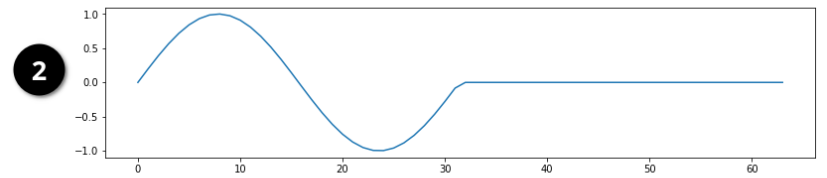
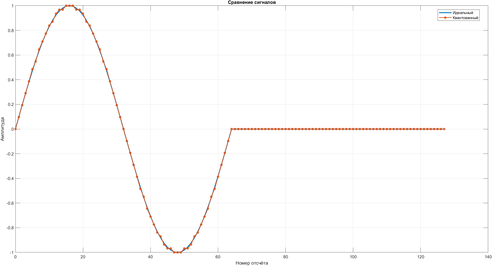
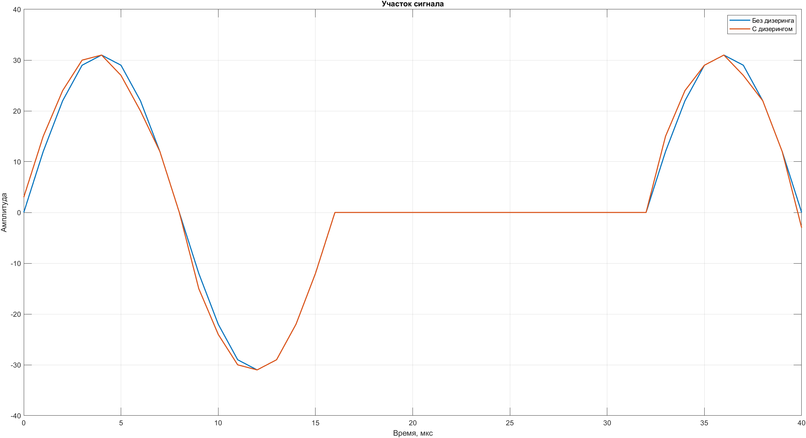
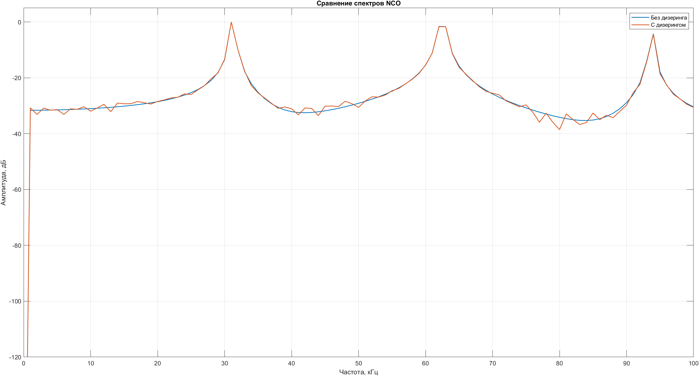

# Лабораторная работа №3. NCO

## Цель работы: 
Изучение принципов работы цифрового генератора сигналов (NCO), его реализация на языке Verilog, исследование спектральных характеристик генерируемого сигнала и анализ влияния дизеринга на уровень паразитных гармоник.

### Исходные данные и постановка задачи
По варианту заданы следующие параметры:
- Разрядность фазового генератора 7 бит
- Разрядность преобразователя фазы в амплитуду (PAC) 6 бит
- Частота выходного сигнала 31,25 кГц
- Тактовая частота 1 МГц (выбрана самостоятельно)


<p align="center">
  Рисунок 1 – Референс генерируемого сигнала
</p>

Выходная частота NCO определяется выражением:

$$
f_{out} = \frac{\Delta f}{2^N} \cdot f_{clock}
$$

Инкремент фазы определяется из выражения:

$$
\Delta f = \frac{f_{out} \cdot 2^N}{f_{clock}}
$$

Подставляя численные значения, получим:

$$
\Delta f = \frac{31{,}25 \cdot 10^3 \cdot 2^7}{1 \cdot 10^6} = 4
$$
Таким образом, значение управляющего слова равно:

$$
FCW = 4
$$

Минимальный шаг изменения частоты определяется как:

$$
f_{res} = \frac{f_{clock}}{2^N}
$$

Для заданных параметров:

$$
f_{res} = \frac{1 \cdot 10^6}{2^7} = 7{,}8125 \cdot 10^3 \ \text{Гц}
$$

Выходная частота может быть представлена как кратная разрешению:

$$
f_{out} = k \cdot f_{res}
$$

где $k$ — целое число.

Фаза сигнала на $n$-ом шаге определяется как:

$$
\varphi[n] = \varphi[n-1] + \Delta f
$$

### Формирование таблицы LUT (MATLAB)

Для формирования таблицы значений синусоидального сигнала использовалась среда MATLAB.

Поскольку в реализации используется фазовый аккумулятор разрядности $N = 7$, полный период сигнала разбивается на $2^7 = 128$ дискретных отсчётов.

Разрядность амплитуды составляет $M = 6$ бит, что соответствует $2^6 = 64$ возможным уровням.

В знаковом представлении диапазон значений составляет $[-32, 31]$.  
В работе использовался диапазон $[-31, 31]$.

Синусоидальный сигнал был сгенерирован, нормирован по амплитуде и квантован до заданной разрядности. Полученные значения были сохранены в текстовый файл в шестнадцатеричном формате для последующей загрузки в ROM-память с помощью функции `readmemh` в Verilog.

Основные параметры:

- Разрядность фазового аккумулятора: $N = 7$
- Разрядность амплитуды: $M = 6$
- Количество отсчётов: $2^N = 128$
- Диапазон амплитуды: $[-31, 31]$


<p align="center">
  Рисунок 2 – Сравнение идеального и квантованного сигналов
</p>

### RTL-описание NCO и тестирование
Модуль nco_top реализует цифровой генератор сигналов на основе фазового аккумулятора и таблицы значений (LUT).

На каждом такте при разрешающем сигнале en значение фазового аккумулятора увеличивается на величину fcw. Таким образом формируется линейно возрастающая фаза сигнала.

Полученное значение фазы используется как адрес для обращения к таблице значений синуса (LUT), загруженной из файла lut_signal2.hex. В таблице хранятся квантованные значения синусоидального сигнала, полученные ранее в MATLAB.

В результате на выходе nco_out формируется дискретный синусоидальный сигнал. Частота сигнала определяется значением fcw: чем больше шаг изменения фазы, тем выше частота выходного сигнала.

Для удобства анализа в модуле предусмотрен отладочный сигнал phase_dbg, позволяющий наблюдать текущее значение фазы.

``` verilog
module nco_top #(
    parameter PHASE_W = 7,
    parameter AMP_W   = 6,
    parameter ROM_FILE = "lut_signal2.hex"
)(
    input  wire                      clk,
    input  wire                      rst_n,
    input  wire                      en,
    input  wire [PHASE_W-1:0]        fcw,
    output wire signed [AMP_W-1:0]   nco_out,
    output wire [PHASE_W-1:0]        phase_dbg
);

wire [PHASE_W-1:0] phase;

phase_accumulator #(
    .PHASE_W(PHASE_W)
) u_phase_accumulator (
    .clk   (clk),
    .rst_n (rst_n),
    .en    (en),
    .fcw   (fcw),
    .phase (phase)
);

nco_rom #(
    .ADDR_W   (PHASE_W),
    .DATA_W   (AMP_W),
    .ROM_FILE (ROM_FILE)
) u_nco_rom (
    .addr (phase),
    .data (nco_out)
);

assign phase_dbg = phase;

endmodule  
```

Далее был создан тестбенч, для проверки корректности работы модели

``` verilog
`timescale 1ns/1ps

module tb_nco_no_dither;

localparam PHASE_W = 7;
localparam AMP_W   = 6;
localparam N_SAMPLES = 1000;   // нужное количество отсчетов

reg clk;
reg rst_n;
reg en;
reg [PHASE_W-1:0] fcw;

wire signed [AMP_W-1:0] nco_out;
wire [PHASE_W-1:0] phase_dbg;

integer file_out;
integer sample_count;

nco_top #(
    .PHASE_W(PHASE_W),
    .AMP_W(AMP_W),
    .ROM_FILE("lut_signal2.hex")
) dut (
    .clk      (clk),
    .rst_n    (rst_n),
    .en       (en),
    .fcw      (fcw),
    .nco_out  (nco_out),
    .phase_dbg(phase_dbg)
);

/* ============================
   clk = 1 МГц
   ============================ */
initial begin
    clk = 1'b0;
    forever #500 clk = ~clk;
end

/* ============================
   основной сценарий
   ============================ */
initial begin
    $display("TB START");

    rst_n = 0;
    en    = 0;
    fcw   = 7'd4;
    sample_count = 0;

    file_out = $fopen("nco_out_no_dither.txt", "w");

    if (file_out == 0) begin
        $display("ERROR: fopen failed");
        $finish;
    end

    #2000;
    rst_n = 1;
    en    = 1;
end

/* ============================
   запись + остановка
   ============================ */
always @(posedge clk) begin
    if (rst_n && en) begin
        $fdisplay(file_out, "%0d", nco_out);

        sample_count = sample_count + 1;

        if (sample_count == N_SAMPLES) begin
            $display("DONE, samples = %0d", sample_count);

            $fclose(file_out);

            #10;
            $finish;
        end
    end
end

endmodule 
```
В результате моделирования был получен файл nco_out_no_dither.txt, содержащий дискретные значения выходного сигнала. Далее эти значения используются для сравнения модели без дизеренга и с ним.

### Дизеринг

В NCO фаза и амплитуда задаются с ограниченной точностью, так как используются конечные разрядности регистров для хранения их значений. Сигнал изменяется дискретно по уровням, из-за этого возникает ошибка квантования — округление реального сигнала до ближайшего значения по уровню. При этом шаг изменения фазы остаётся постоянным, поэтому такая ошибка повторяется с определённым периодом. Поскольку ошибка повторяется регулярно, она проявляется в спектре не как случайный шум, а как отдельные паразитные гармоники.

Для уменьшения этих гармоник применяется дизеринг, то есть добавление псевдослучайного сигнала к фазе. В результате ошибка квантования становится менее регулярной и начинает вести себя как шум. Это приводит к тому, что выраженные гармоники уменьшаются, а их энергия распределяется по спектру.

При использовании дизеринга фазовое значение меняется по формуле:

$$
\varphi_{mod} = \varphi + dither
$$

Добавление шума реализуется при помощи ранее созданного LFSR

``` verilog
module nco_dither_top #(
    parameter PHASE_W  = 7,
    parameter AMP_W    = 6,
    parameter ROM_FILE = "lut_signal2.hex"
)(
    input  wire                    clk,
    input  wire                    rst_n,
    input  wire                    en,
    input  wire [PHASE_W-1:0]      fcw,
    output wire signed [AMP_W-1:0] nco_out,
    output wire [PHASE_W-1:0]      phase_dbg,
    output wire                    dither_dbg,
    output wire [PHASE_W-1:0]      addr_dbg,
    output wire [25:0]             lfsr_dbg
);

wire [PHASE_W-1:0] phase;
wire [25:0] lfsr_state;
wire [PHASE_W-1:0] addr_dithered;

/* ================================
   Фазовый аккумулятор
   ================================ */
phase_accumulator #(
    .PHASE_W(PHASE_W)
) u_phase_accumulator (
    .clk   (clk),
    .rst_n (rst_n),
    .en    (en),
    .fcw   (fcw),
    .phase (phase)
);

/* ================================
   Твой LFSR26
   ================================ */
lfsr26 u_lfsr26 (
    .clk   (clk),
    .rst_n (rst_n),
    .en    (en),
    .state (lfsr_state)
);

/* ================================
   Дизеринг:
   используем младший бит LFSR
   0 -> +0
   1 -> +1
   ================================ */
assign addr_dithered = phase + lfsr_state[0];

/* ================================
   LUT / ROM
   ================================ */
nco_rom #(
    .ADDR_W   (PHASE_W),
    .DATA_W   (AMP_W),
    .ROM_FILE (ROM_FILE)
) u_nco_rom (
    .addr (addr_dithered),
    .data (nco_out)
);

/* ================================
   Отладочные сигналы
   ================================ */
assign phase_dbg  = phase;
assign dither_dbg = lfsr_state[0];
assign addr_dbg   = addr_dithered;
assign lfsr_dbg   = lfsr_state;

endmodule

```

<p align="center">
  Рисунок 3 – Сравнение формы генерируемых сигналов без дизеренга и с дизеренгом
</p>

Динамический диапазон свободный от паразитных составляющих определяется как логарифм отношения амплитуды гармоники сигнала к амплитуде самой большой паразитной гармоники

$$
SFDR = 20 \log_{10} \left( \frac{A_{main}}{A_{spur}} \right)
$$


<p align="center">
  Рисунок 4 – Сравнение спектров без дизеренга и с дизеренгом
</p>

``` MATLAB
================ РЕЗУЛЬТАТЫ ================

Без дизеринга:
Основной пик: 31.000 кГц
Наибольший spur: 62.000 кГц
SFDR = 1.59 дБ

С дизерингом:
Основной пик: 31.000 кГц
Наибольший spur: 62.000 кГц
SFDR = 1.66 дБ

Изменение SFDR: 0.07 дБ
```
Незначительное изменение SFDR связано с тем, что наибольшая спектральная составляющая после основной определяется гармоникой формы заданного сигнала, а не только паразитными составляющими, вызванными квантованием. Дизеринг в большей степени влияет на мелкие дискретные составляющие спектра, перераспределяя их энергию в шумовой фон.

## Вывод:

В ходе лабораторной работы был изучен принцип работы цифрового генератора сигналов NCO. В MATLAB была сформирована таблица LUT для заданного сигнала, после чего она была использована в Verilog-модели генератора.

Был реализован модуль NCO без дизеринга, состоящий из фазового аккумулятора и ROM-памяти с заранее рассчитанными отсчётами сигнала. По результатам моделирования был получен выходной сигнал с требуемой частотой.

Также была реализована версия NCO с дизерингом, где к значению фазы добавлялась псевдослучайная составляющая, формируемая с помощью LFSR. По результатам спектрального анализа было показано, что дизеринг изменяет распределение спектральных составляющих и переводит часть регулярных искажений в шумовой фон.

Значение SFDR изменилось незначительно, так как максимальная спектральная составляющая после основной определяется в первую очередь гармоникой формы заданного сигнала. Тем не менее применение дизеринга позволяет уменьшить регулярность ошибок квантования и улучшить характер спектра.