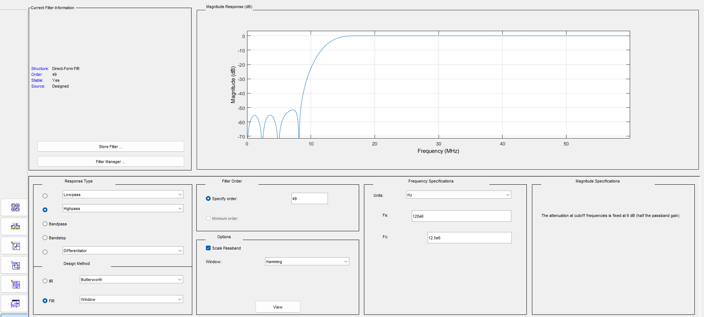
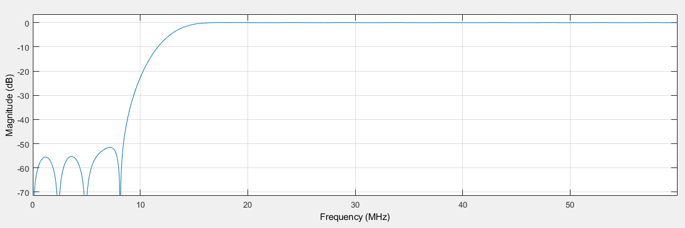
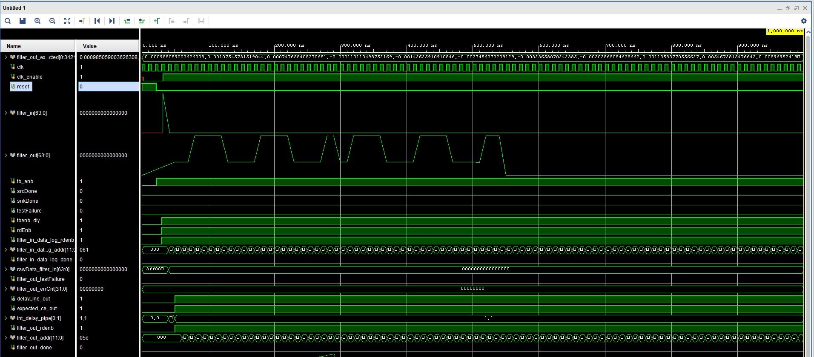
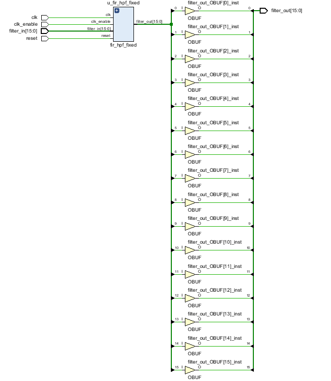
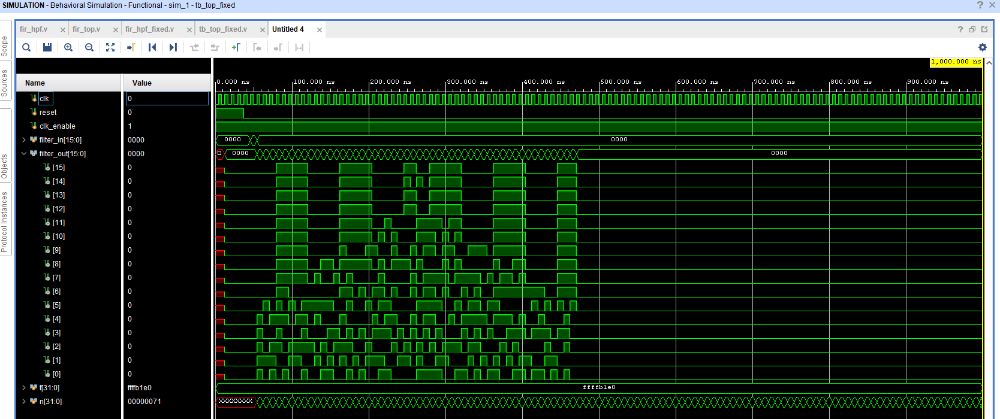
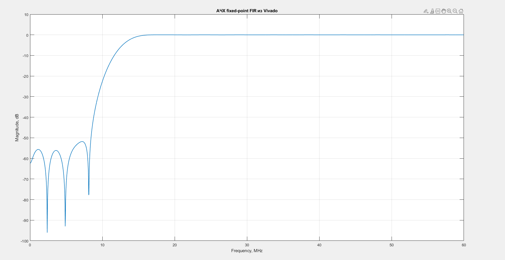

# Лабораторная работа №4. FIR-фильтр

## Цель работы: 
Реализация цифрового КИХ-фильтра на языке Verilog, проведение его моделирования в среде Vivado и анализ характеристик фильтра с использованием MATLAB.

### Исходные
По варианту заданы следующие параметры:
- частота дискретизации 120 МГц
- частота среза 10 МГц
- порядок фильтра 49
- тип фильтра HPF (ФВЧ)

### Работа с MATLAB Filter Designer

Для получения коэффициентов и HDL-описания КИХ-фильтра воспользуемся MATLAB Filter Designer, для этого введём необходимые параметры в окно, как показано на рисунке 1.


<p align="center">
  Рисунок 1 – Параметры синтеза КИХ-фильтра в среде MATLAB
</p>

На рисунке 2 представлена полученная АЧХ. Видим, что фильтр эффективно подавляет низкочастотные составляющие сигнала и пропускает частоты выше заданной частоты среза. Переходная область фильтра определяется его порядком и характеризует плавность перехода от полосы подавления к полосе пропускания.



<p align="center">
  Рисунок 2 – АЧХ КИХ-фильтра верхних частот
</p>

На основе синтезированного фильтра в MATLAB были получены коэффициенты и HDL-описание, которые далее использовались для реализации фильтра в среде Vivado.


### Моделирование HDL-описания фильтра в Vivado

После синтеза фильтра в MATLAB было получено HDL-описание, которое было импортировано в среду Vivado для проведения моделирования.

В процессе моделирования на вход фильтра подавался тестовый сигнал в виде одиночного импульса, что позволяет оценить импульсную характеристику фильтра и корректность его работы.


<p align="center">
  Рисунок 3 – Результаты моделирования HDL-описания КИХ-фильтра в Vivado
</p>

В ходе моделирования на вход фильтра подавался одиночный импульс, что позволяет наблюдать мпульсную характеристику на выходе.

На временных диаграммах видно, что после подачи импульса на входе формируется последовательность ненулевых отсчётов на выходе фильтра, соответствующая коэффициентам КИХ-фильтра. Длительность выходного отклика ограничена числом коэффициентов, что соответствует конечной импульсной характеристике фильтра порядка 49. Форма выходного сигнала отражает структуру коэффициентов фильтра и подтверждает корректность выполнения операций умножения и суммирования в реализованной схеме.

Таким образом, результаты моделирования подтверждают корректную работу HDL-описания на уровне функциональной симуляции.

После проверки сгенерированного HDL-описания был выбран подход с отдельным использованием коэффициентов фильтра. Это позволило явно задать структуру КИХ-фильтра в Verilog и упростить дальнейший анализ результатов моделирования и синтеза в Vivado.
Файлы, сгенерированные в MATLAB, лежат в ресурсах:
`fir_hpf.v` — описание КИХ-фильтра;
`filter_tb.v` — тестовое окружение для моделирования фильтра.

### Собственная реализация фильтра в Vivado

Для реализации фильтра в среде Vivado коэффициенты, полученные в MATLAB, были приведены к формату, пригодному для использования в Verilog.

Поскольку аппаратная реализация предполагает использование чисел фиксированной разрядности, вещественные коэффициенты фильтра были квантованы и представлены в целочисленном виде. Полученные значения были сохранены в файл формата .hex, содержащий коэффициенты в шестнадцатеричной системе счисления.
В отличие от автоматически сгенерированного HDL-описания, была реализована собственная структура КИХ-фильтра на языке Verilog, обеспечивающая более наглядное представление алгоритма обработки сигнала.

Фильтр реализован в соответствии с выражением:

$$
y[n] = \sum_{k=0}^{N} h[k] \cdot x[n-k]
$$

где:
- `x[n]` — входной сигнал;
- `h[k]` — коэффициенты фильтра;
- `y[n]` — выходной сигнал.

Структура фильтра включает:
- линию задержки входных отсчётов;
- массив коэффициентов;
- блоки умножения;
- сумматор, формирующий выходной сигнал.

Коэффициенты фильтра загружаются из внешнего файла с использованием системной функции:

```verilog
$readmemh("fir_coeff.hex", coeff);
```

Основной модуль фильтра `fir_hpf_fixed` реализует вычисление свёртки входного сигнала с коэффициентами фильтра. 

Внутри модуля формируется линия задержки, обеспечивающая хранение предыдущих отсчётов входного сигнала. Далее выполняется операция умножения каждого отсчёта на соответствующий коэффициент и суммирование полученных произведений. Для предотвращения переполнения используется аккумулятор увеличенной разрядности.

После суммирования результат масштабируется с помощью арифметического сдвига, что соответствует использованию фиксированной точки (формат Q1.15).

``` verilog
`timescale 1ns / 1ps

module fir_hpf_fixed (
    input  wire clk,
    input  wire reset,
    input  wire clk_enable,
    input  wire signed [15:0] filter_in,
    output reg  signed [15:0] filter_out
);

    // коэффициенты
    reg signed [15:0] coeff [0:49];

    initial begin
    $readmemh("C:/Users/maria/Desktop/4_2/project_1/project_1.srcs/sim_1/new/fir_coeff.hex", coeff);
    end

    // линия задержки
    reg signed [15:0] delay [0:49];
    integer i;

    always @(posedge clk) begin
        if (reset) begin
            for (i = 0; i < 50; i = i + 1)
                delay[i] <= 0;
        end else if (clk_enable) begin
            delay[0] <= filter_in;
            for (i = 1; i < 50; i = i + 1)
                delay[i] <= delay[i-1];
        end
    end

    // умножение + суммирование
    reg signed [31:0] acc;

    always @(*) begin
        acc = 0;
        for (i = 0; i < 50; i = i + 1)
            acc = acc + delay[i] * coeff[i];
    end

    // масштабирование обратно
    always @(posedge clk) begin
        if (clk_enable)
            filter_out <= acc >>> 15;
    end

endmodule
```
Т. об., реализованный модуль соответствует классической структуре КИХ-фильтра и обеспечивает корректное вычисление выходного сигнала на основе входной последовательности и заданных коэффициентов.

Для интеграции фильтра в проект был разработан верхний модуль `top_fixed`, который выполняет инстанцирование основного фильтра и обеспечивает передачу входных и выходных сигналов.

В модуле используются атрибуты `KEEP` и `DONT_TOUCH`, предотвращающие оптимизацию со стороны синтезатора Vivado. Это необходимо для сохранения структуры фильтра в процессе синтеза и корректного анализа его работы.

``` verilog
`timescale 1ns / 1ps

module top_fixed (
    input  wire clk,
    input  wire reset,
    input  wire clk_enable,
    input  wire signed [15:0] filter_in,
    output wire signed [15:0] filter_out
);

    (* KEEP = "TRUE" *) wire signed [15:0] filter_out_internal;

    (* DONT_TOUCH = "TRUE" *)
    fir_hpf_fixed u_fir_hpf_fixed (
        .clk        (clk),
        .reset      (reset),
        .clk_enable (clk_enable),
        .filter_in  (filter_in),
        .filter_out (filter_out_internal)
    );

    assign filter_out = filter_out_internal;

endmodule
```
Т. об., реализованный модуль соответствует классической структуре КИХ-фильтра и обеспечивает корректное вычисление выходного сигнала на основе входной последовательности и заданных коэффициентов.


<p align="center">
  Рисунок 4 – Структурная схема реализованного КИХ-фильтра после синтеза в Vivado
</p>

На рисунке 4 показана структурная схема фильтра после синтеза в Vivado. Видно, что основной модуль фильтра подключён к выходным буферам (OBUF), которые автоматически добавляются системой для работы с выводами ПЛИС.

Схема подтверждает, что фильтр корректно реализован и подключён, а его структура сохраняется после синтеза.

Для проверки работы реализованного фильтра был разработан тестовый модуль `tb_top_fixed`, выполняющий моделирование во временной области.

В тестбенче формируется тактовый сигнал, выполняется сброс системы и подаётся тестовое воздействие в виде единичного импульса. Такой сигнал позволяет получить импульсную характеристику фильтра.

В процессе моделирования выходные значения фильтра записываются в текстовый файл, который далее используется для анализа в MATLAB.

``` verilog
`timescale 1ns / 1ps

module tb_top_fixed;

    reg clk = 0;
    reg reset = 1;
    reg clk_enable = 1;
    reg signed [15:0] filter_in;
    wire signed [15:0] filter_out;

    integer f;
    integer n;

    top_fixed dut (
        .clk(clk),
        .reset(reset),
        .clk_enable(clk_enable),
        .filter_in(filter_in),
        .filter_out(filter_out)
    );

    // 120 MHz clock: period ≈ 8.333 ns
    always #4.166 clk = ~clk;

    initial begin
        f = $fopen("fir_impulse_response.txt", "w");

        filter_in = 0;

        // reset
        repeat(5) @(posedge clk);
        reset = 0;

        // единичный импульс в Q1.15: 1.0 ≈ 32767
        @(posedge clk);
        filter_in = 16'sd32767;

        @(posedge clk);
        filter_in = 16'sd0;

        // записываем выходные отсчёты
        for (n = 0; n < 200; n = n + 1) begin
            @(posedge clk);
            $fwrite(f, "%d\n", filter_out);
        end

        $fclose(f);
        $stop;
    end

endmodule
```
Использование тестбенча позволяет провести функциональную проверку фильтра и получить численные данные для последующего анализа его характеристик.


<p align="center">
  Рисунок 5 – Временные диаграммы работы КИХ-фильтра верхних частот при моделировании в Vivado
</p>

На рисунке 5 представлены временные диаграммы работы фильтра. Видно, что при подаче единичного импульса на вход формируется последовательность выходных отсчётов, соответствующая импульсной характеристике КИХ-фильтра.

Длительность отклика определяется порядком фильтра, а форма сигнала отражает значения его коэффициентов. Это подтверждает корректную реализацию операций задержки, умножения и суммирования.


<p align="center">
  Рисунок 6 – АЧХ фильтра, полученная на основе результатов моделирования
</p>

На основе полученных выходных данных была построена амплитудно-частотная характеристика фильтра (рисунок 6). 

Сравнивая полученную АЧХ (рисунок 6) с характеристикой, рассчитанной в MATLAB (рисунок 2), можно заметить, что в целом форма характеристик совпадает. В обоих случаях наблюдается подавление низких частот и пропускание высокочастотной области, что соответствует фильтру верхних частот.

Небольшие отличия в уровне подавления и форме переходной области связаны с использованием фиксированной точности при реализации фильтра в Verilog. Квантование коэффициентов и ограниченная разрядность приводят к искажениям характеристик по сравнению с идеальной моделью в MATLAB.

Таким образом, реализованный фильтр корректно воспроизводит требуемую характеристику, а наблюдаемые отклонения являются ожидаемыми для реализации с фиксированной точкой.

## Вывод:

## Вывод:

В ходе выполнения лабораторной работы был синтезирован КИХ-фильтр верхних частот в среде MATLAB с заданными параметрами и получена его амплитудно-частотная характеристика.

На основе рассчитанных коэффициентов была выполнена реализация фильтра на языке Verilog в среде Vivado и проведено моделирование. По результатам моделирования получена импульсная характеристика и построена АЧХ фильтра.

Сравнение показало, что реализованный фильтр в целом соответствует исходной характеристике: обеспечивается подавление низких частот и пропускание высоких.

При этом наблюдаются небольшие отличия в глубине подавления и форме переходной области. Они связаны с использованием фиксированной точности, что приводит к квантованию коэффициентов, а также с ограниченной разрядностью данных и округлением при вычислениях.

В целом реализованный фильтр работает корректно и подтверждает возможность переноса алгоритмов цифровой обработки сигналов из MATLAB в аппаратную реализацию на ПЛИС.